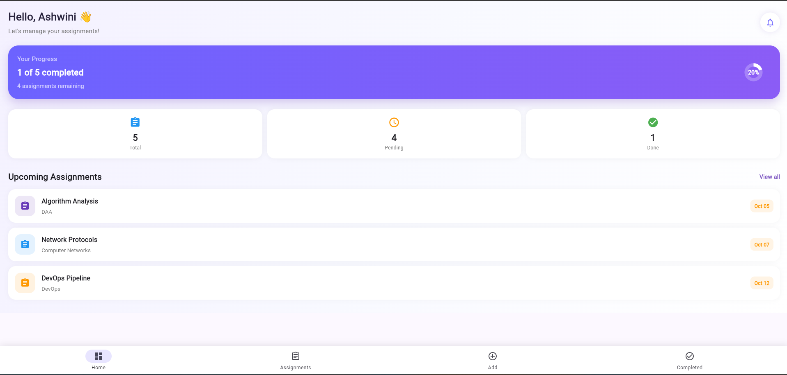
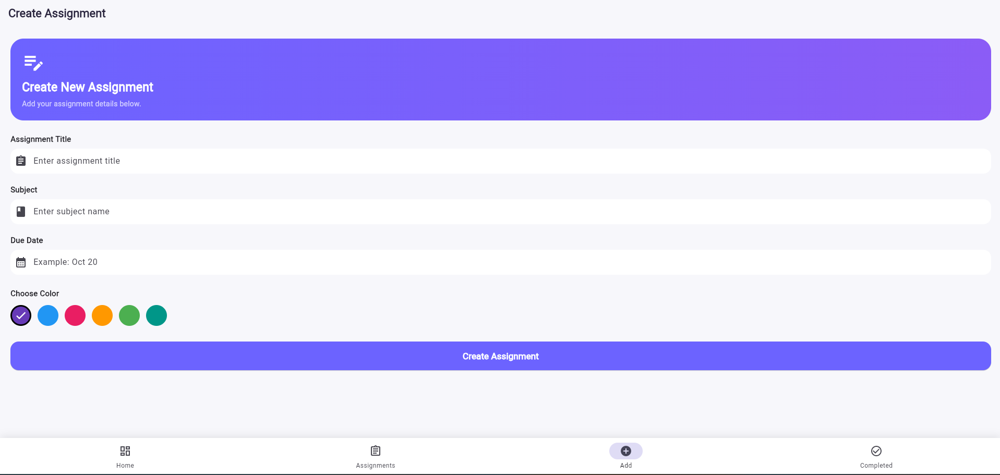
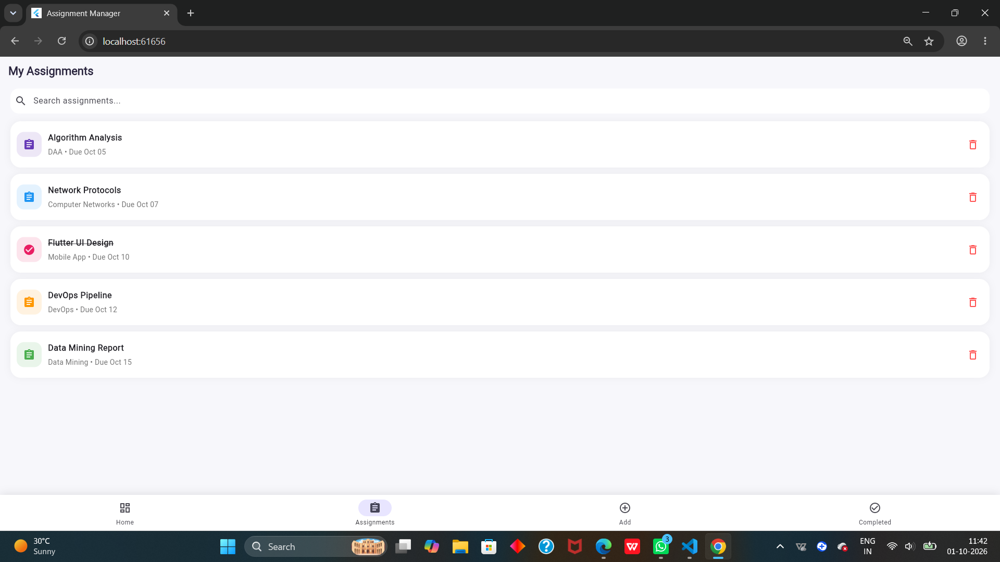
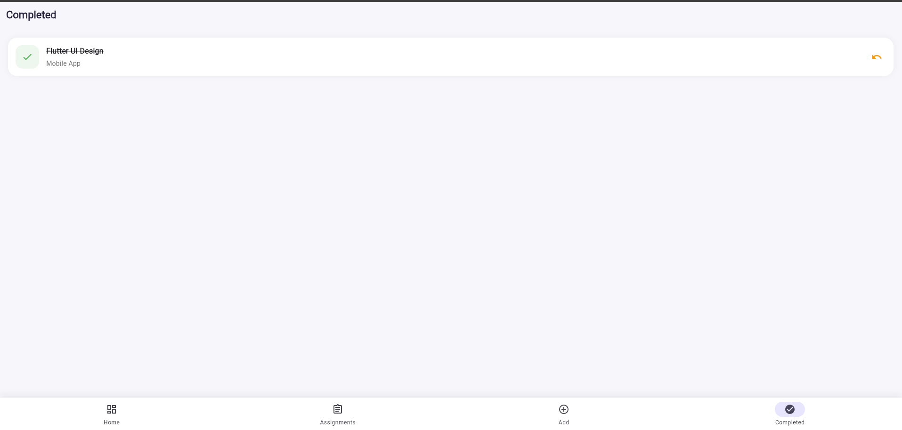

# 📚 Flutter Assignment Manager

A simple and user-friendly **Assignment Manager mobile application** built using **Flutter**. The app helps students organize their assignments, keep track of deadlines, manage assignment details, and stay organized with their academic work.

## 📱 Features

- ➕ Add new assignments
- 📝 Enter assignment title and description
- 📅 Select assignment due date
- 🏷️ Organize assignments by subject/category
- ⏰ Track assignment deadlines
- ✅ Mark assignments as completed
- 🗑️ Delete assignments
- 📋 View all assignments in one place
- 🎨 Clean and attractive user interface
- 📱 Responsive Flutter UI
- 🔄 Dynamic assignment list management

## 🛠️ Tech Stack

- **Flutter**
- **Dart**
- **Material UI**
- **VS Code**
- **Git & GitHub**

## 📂 Project Structure

```text
assignment_manager/
│
├── lib/
│   ├── main.dart
├── assets/
│
├── test/
│
├── android/
├── ios/
├── web/
├── windows/
│
├── pubspec.yaml
└── README.md
🚀 Getting Started
1. Clone the repository
git clone https://github.com/Ashwini-3105/assignment_manager.git
2. Open the project
cd assignment_manager
3. Install dependencies
flutter pub get
4. Run the application

For Chrome:

flutter run -d chrome

For Android:

flutter run

## 🖥️ Application Preview

### 🏠 Home Screen


### ➕ Add Assignment


### 📋 Assignment List


### ✅ Completed Assignments



This project was developed to practice Flutter application development and create a useful academic productivity application.

The project demonstrates:

Flutter widgets
Stateful and Stateless widgets
User input handling
Form handling
Lists and dynamic UI
Date selection
Assignment management
UI design
Flutter navigation
Git and GitHub project management
🔮 Future Improvements

The application can be extended with:

💾 Local database/storage
🔔 Assignment deadline notifications
📊 Assignment progress analytics
🔐 User authentication
☁️ Cloud data synchronization
📅 Calendar-based assignment view
🔎 Search and filter assignments
🌙 Dark mode
🎨 Custom themes
📈 Academic progress dashboard
👩‍💻 Author

A ASHWINI

B.Tech – Computer Science & Engineering

📄 License

This project is created for educational and portfolio purposes.


